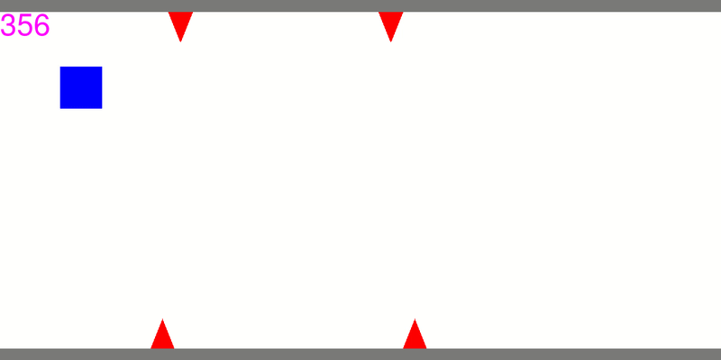

# Evolutionary-Algorithm

## Authors: Julia Skoneczna, Radosław Radziukiewicz
### Packages: pygame, numpy

---

## Project Overview
The main goal of this project was to implement classical evolutionary algorithm.
It's target was to evolve special individuals (in our case these were neural networks)
which were playing simple game. As the result, we obtained individuals which get a score
around 10x better than starting ones (initial population). Those results were obviously preceded by
hyper parameters tuning.

---

## Game 
The game, which evaluates each individual, is a simple sub-version 
of popular game called 'Geometry Dash'. In this game player 
has to avoid obstacles (red spikes). Player's character is a blue cube
which is capable of switching sides of a track on which it is traveling
(it can go on the floor or on the celling). Player score is directly 
connected with length of the track he has travelled.

---

## Individuals

The individuals, which are playing our game, are simple neural networks.
They consist of fully-connected layers and use sigmoid activation function.
During evaluation process they receive vector of input data, and have to 
make a decision, whether to jump or not.

---

## Evolutionary algorithm
As the classic algorithm implies using specific pattern of implementation, it also enables 
to use various strategies of reproduction, selection and crossover. In our case 
we have chosen to use: 

- averaging crossover with weights for each feature
- tournament selection
- elite reproduction

Our implementation of evolutionary algorithm enables to specify:
- mutation strength (eta)
- number of iterations 
- population size
- crossover probability
- architecture of individuals

---

## Results
As mentioned above, we have trained individuals which have achieved much better score than
regular, randomly initialized networks. Before that, we have performed many time-consuming tests 
in order to tune all hyper parameters.  
Moreover, during learning process
we have been able to spot classical features of evolutionary algorithm (getting stuck in local optima,
too strong or too weak mutation strength etc.).  
Finally, below we present a gif showing one of the results of our work 
(network trained achieves score around 3000 whereas 360 is the regular score 
achieved by untrained network)

Weights and biases of this network are stored in file Net.json.